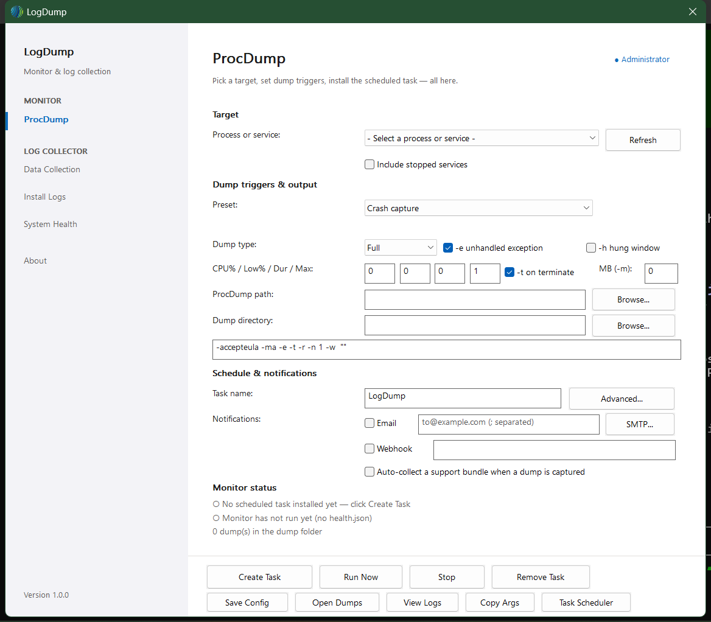
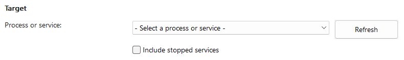
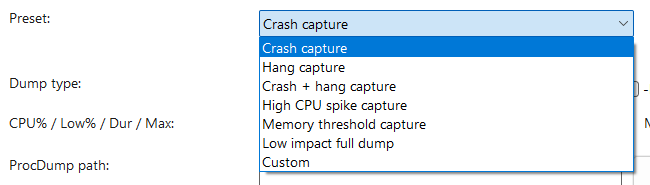
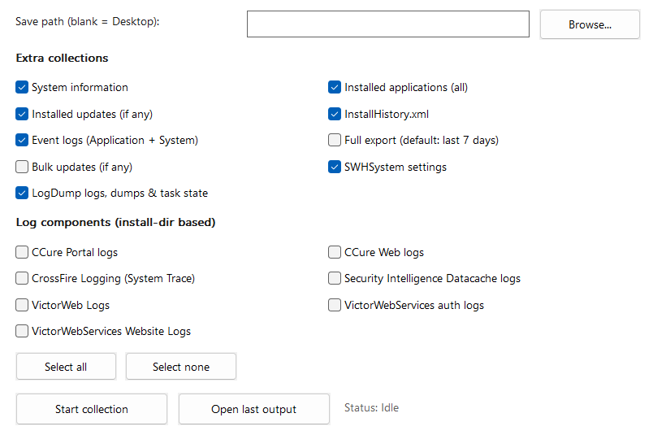
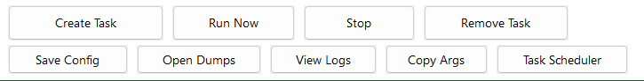

# LogDump — Crash Capture Guide

---

## What this tool does

When a C&bull;CURE 9000 service crashes, the evidence needed to explain it exists only
in the instant it fails. LogDump waits for that instant and captures it.

It does two jobs, and you can use either on its own:

- **Watch and capture.** Point it at a process or service. It installs a Windows
  Scheduled Task that waits &mdash; through reboots, for as long as it takes &mdash; and
  captures a full memory dump the moment the target crashes, hangs, or crosses a
  CPU or memory threshold.
- **Collect.** Gather C&bull;CURE application, web, installer and event logs into one
  timestamped bundle you can send to support.

It is a single executable. Nothing is installed, no runtime is required, and
nothing about C&bull;CURE is modified.

<div class="callout">
<p><strong>Which half do you need?</strong> If a service is crashing and nobody knows
why, you need <strong>Part 1</strong>. If support has asked you for logs, you only
need <strong>Part 2</strong> &mdash; skip ahead, it takes about a minute.</p>
</div>

## Before you start

| You need | Detail |
| --- | --- |
| **LogDump.exe** | Supplied by your Johnson Controls engineer. A single file. |
| **ProcDump** | Microsoft Sysinternals, from `learn.microsoft.com/sysinternals/downloads/procdump`. **Not included.** Copy in **both** `procdump64.exe` and `procdump.exe` &mdash; which one is correct depends on the target, and bringing both means you never have to care. Not needed for log collection. |
| **Administrator** | On the server itself. LogDump requests elevation automatically. |
| **Disk space** | A full dump is roughly the size of the target's memory use &mdash; commonly **400&nbsp;MB to 1&nbsp;GB** for a C&bull;CURE service. Allow several GB. |

<div class="warning">
<p><strong>Match ProcDump to the target, or you get nothing</strong></p>
<p>ProcDump ships as <code>procdump.exe</code> (32-bit) and <code>procdump64.exe</code>
(64-bit), and the two are not interchangeable. A 32-bit ProcDump <strong>cannot
capture a 64-bit process at all</strong> &mdash; it produces no dump and no obvious
error, and you discover this only after the crash you were waiting for.</p>
<p>Which one you need depends on the target, not on the server. The C&bull;CURE
services are 64-bit; the <strong>Admin Workstation</strong> and
<strong>Monitoring Station</strong> clients are 32-bit. Copy in
<strong>both</strong> binaries and LogDump picks the right one &mdash; see
<em>Which ProcDump does your target need?</em> after Step&nbsp;3.</p>
</div>

<div class="phase-header">Part 1 &mdash; Capture a crash dump</div>

### 1. Put both files in one folder

On the server, create a folder such as `C:\LogDump` and copy in:

```text
C:\LogDump\
    LogDump.exe
    procdump64.exe
```

<div class="callout">
<p><strong>Give it its own folder.</strong> LogDump writes its settings
(<code>config.json</code>), its status file (<code>health.json</code>) and its log
next to itself. Do not run it from a network share, from removable media, or from
inside <code>C:\Program Files</code>.</p>
</div>

### 2. Run it as Administrator

Double-click `LogDump.exe`. Windows shows a User Account Control prompt &mdash; that
is expected; choose **Yes**. It opens on the **ProcDump** page.

<figure class="screenshot">

<figcaption>The ProcDump page on first run. Everything needed to arm a capture is
here: target at the top, triggers in the middle, live status above the buttons.</figcaption>
</figure>

### 3. Choose the target, then check the line underneath

<figure class="screenshot detail">

<figcaption>The Target row. <strong>Refresh</strong> re-reads the machine if the
service started after you opened LogDump.</figcaption>
</figure>

Open **Process or service** and pick the service that is crashing. Running
processes appear as `Proc:` and Windows services as `Svc:`. For the main C&bull;CURE
server that is:

```text
Proc: SoftwareHouse.CrossFire.Server.exe
```

If the target is not running right now, tick **Include stopped services** to see
stopped ones. LogDump can arm a capture for something that is not running yet &mdash;
it waits for the process to start.

Now read the small line directly beneath the dropdown. **This is the most
important line in the application.** It must name the 64-bit binary:

```text
64-bit process -> procdump64.exe (via PE header)
```

<div class="warning">
<p><strong>Stop if that line says anything else</strong></p>
<p>If it reads <code>No ProcDump binary found</code>, ProcDump is not in the folder
&mdash; go back to step&nbsp;1. If it reads <code>could not determine target
bitness</code>, or names <code>procdump.exe</code> for a target you expect to be
64-bit, do not continue: send your Johnson Controls engineer a photo of the window.
Continuing produces an empty or unusable dump.</p>
</div>

<div class="callout">
<p><strong>Why this check exists.</strong> Most C&bull;CURE services are .NET
assemblies built as <em>AnyCPU</em>. Their file header reports 32-bit while Windows
actually runs them 64-bit, so the obvious check gives the wrong answer. LogDump
reads the CLR header to resolve it properly. On a reference C&bull;CURE server, eight
of ten Software House processes share an identical 32-bit file header and split
evenly between 32- and 64-bit at runtime &mdash; which is exactly why this is worth
ten seconds of your attention.</p>
</div>

### Which ProcDump does your target need?

LogDump resolves this itself &mdash; the table is here so you know what to copy onto
the server, and so you can sanity-check the answer it gives you.

Measured on a live C&bull;CURE 9000 server and confirmed against Task Manager:

| Target | Runs as | Needs |
| --- | --- | --- |
| `SoftwareHouse.CrossFire.Server.exe` | 64-bit | `procdump64.exe` |
| `SoftwareHouse.CrossFire.ImportWatcherService.exe` | 64-bit | `procdump64.exe` |
| `SoftwareHouse.CrossFire.ReportServerService.exe` | 64-bit | `procdump64.exe` |
| `SoftwareHouse.NextGen.iSTAR_DriverService.exe` | 64-bit | `procdump64.exe` |
| `…Nantucket.SessionKeyManager.exe` | 64-bit | `procdump64.exe` |
| `…Nantucket.SQLiteManager.exe` | 64-bit | `procdump64.exe` |
| **`SoftwareHouse.NextGen.Client.AdminWorkstation.exe`** | **32-bit** | **`procdump.exe`** |
| **`SoftwareHouse.NextGen.Client.MonitoringStation.exe`** | **32-bit** | **`procdump.exe`** |
| `SoftwareHouse.CrossFire.ServerComponentFramework.exe` | 32-bit | `procdump.exe` |
| `…Nantucket.GlobalAntipassbackManager.exe` | 32-bit | `procdump.exe` |

**In practice:** everything on the server side is 64-bit. The two you will
actually be asked to capture as 32-bit are the **Admin Workstation** and the
**Monitoring Station** &mdash; the client applications an operator is sitting in
front of when it fails. If you are capturing a client rather than a service,
`procdump.exe` is the one that matters.

<div class="warning">
<p><strong>You cannot tell by looking at the file</strong></p>
<p>Eight of the ten binaries above report an <em>identical</em> 32-bit file
header, and they split evenly between 32- and 64-bit at runtime. The name, the
folder and the file properties all fail to distinguish them. This is why the line
under the target in Step&nbsp;3 is the thing to trust &mdash; not this table, and
not intuition.</p>
</div>

Capturing a client application has one extra wrinkle: it runs as the logged-in
operator, while the scheduled task runs as SYSTEM. That works, but the operator
must be logged in for the target to exist at all &mdash; so leave the session
signed in while you wait for the fault.

### 4. Choose what counts as a failure

Open **Preset** and pick how the target is failing.

<figure class="screenshot detail">

<figcaption>Presets are one-click shortcuts. Picking one resets every trigger and
applies that combination.</figcaption>
</figure>

| Preset | Captures when | Use it when |
| --- | --- | --- |
| **Crash capture** | Unhandled exception, or the process exits | The service disappears |
| **Hang capture** | The window stops responding | It freezes but stays running |
| **Crash + hang capture** | Any of the above | You are not sure which &mdash; **the usual choice** |
| **High CPU spike capture** | CPU over 90% for 10s | It pins a core |
| **Memory threshold capture** | Memory commit over 2048&nbsp;MB | You suspect a leak |
| **Low impact full dump** | Immediately, once | You want a snapshot right now |

Leave **Dump type** on **Full**. Anything smaller usually cannot be analysed.

<div class="callout">
<p><strong>The preset list is not the limit.</strong> Presets are shortcuts, not the
only path. Tick any combination of <strong>-e</strong>, <strong>-h</strong>,
<strong>-t</strong>, the CPU fields and <strong>MB (-m)</strong> directly and the
dropdown moves to <strong>Custom</strong>, keeping everything you ticked. Use the
dropdown to snap back to a preset.</p>
</div>

### 5. Say where dumps go

Set **Dump directory** to a folder on a drive with room &mdash; for example
`D:\CCURE-Dumps`. Avoid `C:\Windows`, the desktop, and anything inside a user
profile. Filling the system drive on a C&bull;CURE server causes its own outage.

Leave **ProcDump path** blank if `procdump64.exe` sits beside `LogDump.exe`; it is
found automatically.

### 6. Arm it

Click **Create Task**, then **Run Now**. The **Monitor status** rows above the
buttons should change to show the scheduled task installed and the monitor
running. That panel refreshes itself every few seconds and reads the real state of
the machine &mdash; trust it over anything in this guide.

<div class="success">
<p><strong>That is it. You can close the window.</strong></p>
<p>The capture keeps running without it and starts again by itself if the server
reboots. Leave C&bull;CURE alone and carry on as normal until the fault happens
again.</p>
</div>

<div class="phase-header">Part 2 &mdash; Collect the evidence and send it</div>

### 7. Get the dump

Reopen LogDump and click **Open Dumps** at the bottom. Look for a `.dmp` file
stamped around the time of the failure.

If nothing is there, click **View Logs** &mdash; that is LogDump's own log, and it is
the first thing support will ask for.

### 8. Collect the log bundle

In the sidebar under **LOG COLLECTOR**, click **Data Collection**. The ticked
defaults are the right starting point; add the C&bull;CURE log components relevant to
the fault. Click **Start collection**, then **Open last output** when it finishes.

<figure class="screenshot">

<figcaption>Data Collection. The upper group gathers system state; the lower group
gathers C&bull;CURE component logs from the install directory. Collection runs on a
background thread, so the window stays responsive.</figcaption>
</figure>

Output is a timestamped run folder &mdash; `<base>\YYYY-MM-DD\Run_HHMMSS\` &mdash;
containing the collected trees, a transcript and a `Collection_Summary.txt`, plus a
zip you can send.

The other two collector pages are narrower: **Install Logs** gathers installer
artifacts and `InstallHistory.xml`; **System Health** takes a point-in-time
snapshot of the machine.

### 9. Send them, then stand the capture down

Send your engineer the `.dmp` file and the collection zip. Dumps are large &mdash;
expect to use a file transfer link rather than email.

<div class="warning">
<p><strong>Afterwards</strong></p>
<p>Open LogDump, click <strong>Stop</strong>, then <strong>Remove Task</strong> to
take the scheduled task off the server. Then delete any leftover <code>.dmp</code>
files. A crash dump contains a copy of everything that was in the process's memory
at the moment it failed, which can include credentials and cardholder data. Treat
dumps as sensitive and do not leave copies on the server.</p>
</div>

<div class="phase-header">Reference</div>

### If something looks wrong

| What you see | What it means |
| --- | --- |
| `No ProcDump binary found` | `procdump64.exe` is not beside `LogDump.exe`. Copy it in and reopen LogDump. |
| `could not determine target bitness` | The target could not be resolved &mdash; commonly a service hosted inside `svchost`. Do not continue; contact your engineer. |
| Line names `procdump.exe` unexpectedly | The wrong target is selected, or it genuinely is 32-bit. Confirm against Task Manager &rarr; Details &rarr; Platform. |
| Status panel stays empty | LogDump is not elevated. Close it and reopen as Administrator. |
| Crash happened, no `.dmp` | Click **View Logs** and send the log to your engineer. |

### The buttons along the bottom

<figure class="screenshot detail">

<figcaption>The action row. It appears only on the ProcDump page &mdash; switching
to a collector page hides it.</figcaption>
</figure>

| Button | What it does |
| --- | --- |
| **Create Task** | Saves settings and installs the Scheduled Task. The main action. |
| **Run Now** | Starts the monitor immediately instead of waiting for a reboot. |
| **Stop** | Stops the monitor, leaving the task installed. |
| **Remove Task** | Removes the Scheduled Task from the server. |
| **Save Config** | Writes `config.json` without touching Task Scheduler. |
| **Open Dumps** | Opens the dump folder in Explorer. |
| **View Logs** | Opens LogDump's own log. |
| **Copy Args** | Copies the full ProcDump command line to the clipboard. |
| **Task Scheduler** | Launches `taskschd.msc`. |

### Command line

Every action in the interface has a command-line equivalent, for integrators
scripting a deployment. Verbs also accept a leading `--`.

```text
LogDump.exe                                  launch the interface
LogDump.exe collect                          collect all log workflows to the Desktop
LogDump.exe collect --out D:\Case12345 --workflows data,health
LogDump.exe install   --config <path>        install the Scheduled Task
LogDump.exe start | stop | status | uninstall
LogDump.exe monitor   --config <path>        the loop the Scheduled Task runs
```

`--config` defaults to `config.json` beside the executable. Exit codes: `0`
success, `1` failure, `2` bad arguments.

### What it touches

| | What |
| --- | --- |
| **Writes** | Its own folder (`config.json`, `health.json`, `Logs\`), the dump folder you choose, and the collection output folder you choose. |
| **Creates** | One Windows Scheduled Task, running as SYSTEM, started at boot. Removed by **Remove Task**. |
| **Reads** | The target's file header, service configuration, Windows event logs, and C&bull;CURE log directories. |
| **Does not** | Modify C&bull;CURE, change how any service runs, or send anything anywhere unless you configure email or webhook notifications yourself. |

Capturing a dump briefly suspends the target while the file is written &mdash;
typically under a second for a clone-based capture.
